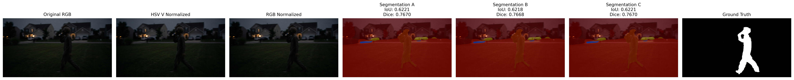

# Advanced Segmentation (Extra Credit)

**Course:** CS 898BA – Image Analysis and Computer Vision  
**Student:** Saikeerthan Jami  
**Repository:** SaikeerthanJami-CS898BA-Project1  
**Branch:** Advanced-Segmentation

---

# Project Overview

The objective of this extra credit assignment is to evaluate the robustness of a modern transformer-based semantic segmentation model when applied to an out-of-distribution image containing an unidentified figure.

Unlike Homework 2, which relied on traditional image processing techniques, this project investigates the performance of **SegFormer**, a pretrained semantic segmentation network, under multiple preprocessing strategies.

The assignment focuses on:

- Transformer-based semantic segmentation
- Multiple image preprocessing techniques
- Quantitative evaluation
- Qualitative analysis
- Comparison with Homework 2

The final objective is to compare the predicted segmentation against the manually created ground truth developed in Homework 2 using both visual analysis and numerical evaluation metrics.

---

# Repository Structure

```
images/

outputs/
    masks/
    overlays/
    metrics/

src/
    preprocess.py
    segmentation.py
    evaluate.py
    visualization.py

README.md
requirements.txt
```

---

# Software Requirements

- Python 3.13
- OpenCV
- NumPy
- Matplotlib
- PyTorch
- Hugging Face Transformers
- Pillow

Install dependencies:

```bash
pip install -r requirements.txt
```

---

# Running the Project

Activate the virtual environment:

```bash
venv\Scripts\activate
```

Run preprocessing:

```bash
python src/preprocess.py
```

Run SegFormer inference:

```bash
python src/segmentation.py
```

Evaluate segmentation:

```bash
python src/evaluate.py
```

Generate the comparison visualization:

```bash
python src/visualization.py
```

The complete pipeline performs:

- Multi-channel preprocessing
- SegFormer semantic segmentation
- Overlay generation
- Quantitative evaluation
- Comparison visualization

---

# Part 1: Channel A (Baseline RGB)

The original RGB image was used as the baseline input for the segmentation model without any modifications.

This channel preserves the original lighting conditions, colors, and contrast captured and serves as the reference for comparing the effects of the additional preprocessing techniques.

---

# Part 2: Channel B (HSV V-Channel Normalization)

The original image was converted from the RGB color space into HSV color space.

Only the Value (V) channel was normalized while preserving the original Hue and Saturation components. The normalized image was then converted back to RGB before being passed to the segmentation model.

## Advantages

- Improves brightness consistency
- Enhances visibility in darker regions
- Preserves original color information

## Disadvantages

- May slightly alter local image contrast
- Can introduce brightness artifacts in highly illuminated regions

---

# Part 3: Channel C (RGB Channel Normalization)

Each RGB channel was independently normalized using OpenCV normalization before being merged back into a single RGB image.

This preprocessing technique increases the dynamic range of each color channel independently while maintaining the overall image structure.

## Advantages

- Improves overall contrast
- Enhances darker image regions
- Preserves structural details

## Disadvantages

- Independent normalization may slightly modify the original color relationships
- Excessive normalization may amplify background textures

---

# Part 4: SegFormer Semantic Segmentation

SegFormer is a transformer-based semantic segmentation architecture designed to perform pixel-level classification without requiring handcrafted image features.

A pretrained **SegFormer-B0** model trained on the ADE20K dataset was used to generate semantic segmentation predictions for each preprocessing channel.

Unlike the classical segmentation techniques implemented in Homework 2, SegFormer performs semantic reasoning over the entire image using hierarchical transformer features rather than relying on pixel intensity or color similarity.

The predicted semantic labels were converted into a binary mask corresponding to the detected person before quantitative evaluation against the Homework 2 ground truth.

---

# Quantitative Evaluation

The manually created binary mask developed during Homework 2 was used as the pseudo-ground truth for evaluating the SegFormer segmentation results.

The semantic segmentation output generated by SegFormer was converted into a binary mask representing the detected person before comparison with the ground truth.

Two evaluation metrics were calculated:

## Intersection over Union (IoU)

\[
IoU = \frac{|A \cap B|}{|A \cup B|}
\]

## Dice Coefficient

\[
Dice = \frac{2|A \cap B|}{|A| + |B|}
\]

---

# Experimental Results

| Input Channel | IoU | Dice |
|---------------|------:|------:|
| Original RGB | **0.6221** | **0.7670** |
| HSV V-Channel Normalization | **0.6218** | **0.7668** |
| RGB Channel Normalization | **0.6221** | **0.7670** |

---

# Discussion of Results

The quantitative evaluation demonstrates that SegFormer successfully localized the unidentified figure across all three preprocessing channels.

The Original RGB image and the RGB channel normalized image produced identical IoU and Dice scores, while HSV V-channel normalization produced only a negligible decrease in performance. The differences between the three preprocessing strategies were limited to the fourth decimal place, indicating that the pretrained SegFormer model is highly robust to moderate variations in image contrast and illumination.

Compared with the classical image segmentation techniques implemented in Homework 2, SegFormer achieved substantially higher overlap with the manually generated ground truth while requiring no manual parameter tuning or threshold selection.

Although the model slightly under-segmented portions of the figure, particularly around the arms and lower legs, it consistently identified the primary subject and produced accurate semantic boundaries throughout the image.

These results demonstrate that transformer-based semantic segmentation provides significantly stronger generalization than traditional image processing methods when applied to challenging outdoor scenes.

---

# Comparison Visualization

The comparison plot displays:

- Original RGB image
- HSV V-channel normalized image
- RGB channel normalized image
- SegFormer segmentation for Channel A
- SegFormer segmentation for Channel B
- SegFormer segmentation for Channel C
- Homework 2 ground truth mask

<p align="center">
    
</p>

---

# Comparison with Homework 2

Homework 2 investigated several classical image segmentation techniques, including Otsu Thresholding, Adaptive Thresholding, and K-Means clustering. These methods relied heavily on manually selected preprocessing operations and algorithm-specific parameters.

In contrast, the SegFormer model performed semantic segmentation using learned transformer representations without requiring manual threshold selection or feature engineering.

While the classical methods were sensitive to illumination changes and image noise, SegFormer maintained nearly identical performance across all three preprocessing channels, demonstrating stronger robustness and improved generalization.

The higher IoU and Dice scores obtained by SegFormer further indicate that modern transformer-based segmentation models provide more accurate object localization than traditional image processing techniques for this challenging image.

---

# Conclusion

This extra credit assignment demonstrates the effectiveness of transformer-based semantic segmentation for challenging out-of-distribution imagery.

SegFormer successfully localized the unidentified figure using semantic understanding rather than handcrafted image processing techniques. The model achieved consistent segmentation performance across all preprocessing channels while maintaining strong agreement with the manually generated ground truth.

The experimental results indicate that transformer-based segmentation models are considerably more robust than classical segmentation methods when applied to low-light outdoor scenes, making them well suited for complex real-world image analysis tasks.

---

# Author

**Saikeerthan Jami (Q459V832)**