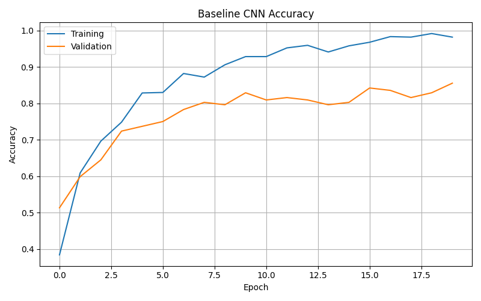
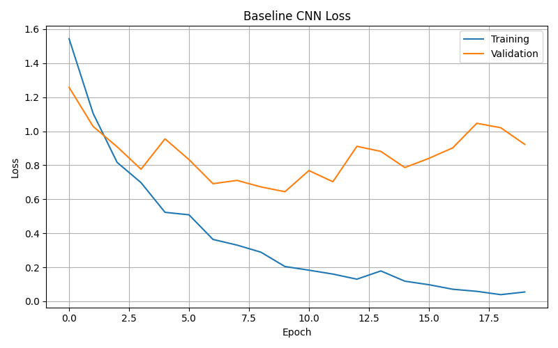
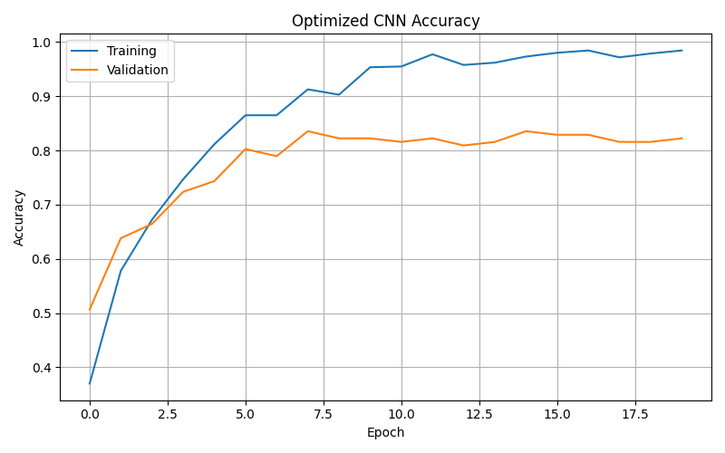
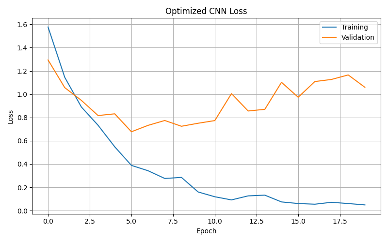
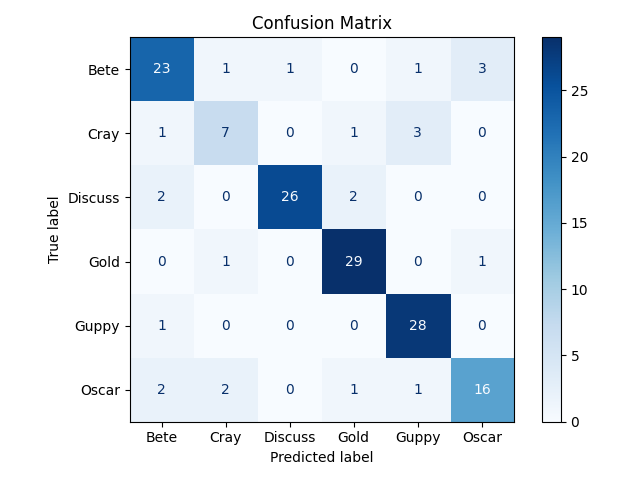

# Homework Three: Deep Learning for Fish Classification

**Course:** CS 898BA – Image Analysis and Computer Vision

**Student:** Saikeerthan Jami

---

# Project Overview

This project implements a complete deep learning pipeline for multi-class fish image classification using TensorFlow/Keras. A custom Convolutional Neural Network (CNN) was developed to classify six fish species. Hyperparameter optimization was performed using KerasTuner to improve model performance, and both the baseline and optimized models were evaluated on an unseen test dataset.

---

# Objectives

- Build a custom CNN from scratch.
- Preprocess and augment the fish image dataset.
- Perform hyperparameter optimization.
- Compare baseline and optimized models.
- Evaluate using multiple classification metrics.
- Visualize training performance and confusion matrices.

---

# Dataset

The dataset contains six fish species.

## Classes

- Bete
- Cray
- Discuss
- Gold
- Guppy
- Oscar

## Dataset Split

| Dataset | Images |
|---------|--------:|
| Training | 711 |
| Validation | 152 |
| Testing | 153 |
| Total | 1016 |

All images were resized to **128 × 128** pixels and normalized to the **[0,1]** range.

---

# Data Preprocessing

The preprocessing pipeline includes:

- Stratified train/validation/test split
- Image resizing (128×128)
- Pixel normalization
- Random horizontal flip
- Random brightness adjustment
- Random contrast adjustment
- TensorFlow Dataset pipeline with batching, shuffling, and prefetching

---

# Baseline CNN Architecture

The custom CNN consists of:

| Layer | Configuration |
|--------|---------------|
| Conv2D | 32 Filters |
| MaxPooling2D | 2×2 |
| Conv2D | 64 Filters |
| MaxPooling2D | 2×2 |
| Conv2D | 128 Filters |
| MaxPooling2D | 2×2 |
| Flatten | — |
| Dense | 128 Units |
| Dropout | 0.30 |
| Output | 6-Class Softmax |

Optimizer:

- Adam

Loss Function:

- Sparse Categorical Crossentropy

Epochs:

- 20

---

# Hyperparameter Optimization

Hyperparameter tuning was performed using **KerasTuner Random Search**.

## Search Space

### Learning Rate

- 0.01
- 0.001
- 0.0001

### Dense Units

- 128
- 256

### Dropout

- 0.30
- 0.50

## Best Hyperparameters

| Hyperparameter | Best Value |
|---------------|-----------:|
| Learning Rate | 0.001 |
| Dense Units | 128 |
| Dropout | 0.30 |

---

# Model Evaluation

## Baseline CNN

| Metric | Score |
|--------|-------:|
| Accuracy | **84.97%** |
| Precision | **85.32%** |
| Recall | **84.97%** |
| F1 Score | **84.54%** |

---

## Optimized CNN

| Metric | Score |
|--------|-------:|
| Accuracy | **84.31%** |
| Precision | **84.30%** |
| Recall | **84.31%** |
| F1 Score | **84.13%** |

---

# Performance Analysis

The baseline CNN achieved excellent classification performance on the testing dataset.

Data augmentation techniques, including horizontal flipping and brightness/contrast adjustments, improved model robustness by exposing the network to more diverse image variations during training.

Hyperparameter tuning explored different combinations of learning rate, dense layer size, and dropout. The optimal validation configuration selected:

- Learning Rate = 0.001
- Dense Units = 128
- Dropout = 0.30

Although this configuration minimized validation loss, the baseline model slightly outperformed the optimized model on the held-out testing dataset. This demonstrates that the best validation model does not always produce the highest testing accuracy due to differences between validation and test distributions.

The Discuss, Gold, and Guppy classes were classified consistently well, while the Cray class remained the most challenging because of fewer training samples and greater visual similarity to other species.

---

# Results

Generated outputs include:

- Baseline Accuracy Curve
- Baseline Loss Curve
- Optimized Accuracy Curve
- Optimized Loss Curve
- Optimized Confusion Matrix
- Classification Reports

These are saved under:

```
outputs/plots/
```
## Training and Evaluation Results











---

# Running the Project

Install dependencies:

```bash
pip install -r requirements.txt
```

Run the complete pipeline:

```bash
python src/main.py
```

The script performs:

1. Data loading and preprocessing
2. Baseline CNN training
3. Hyperparameter tuning
4. Optimized model training
5. Model evaluation
6. Plot generation

---

# Technologies Used

- Python 3.13
- TensorFlow / Keras
- KerasTuner
- NumPy
- Matplotlib
- Scikit-learn
---
