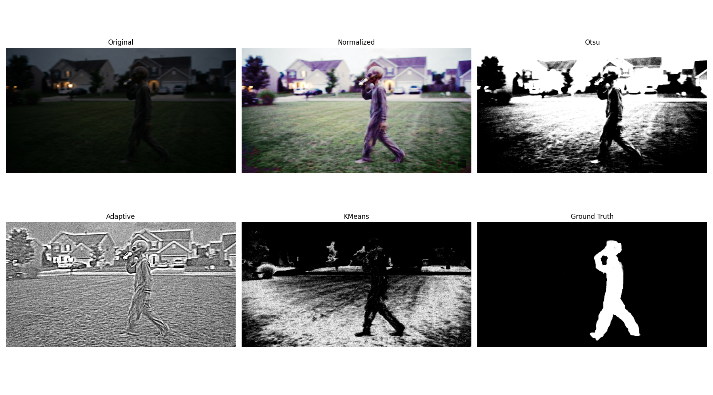

# SaikeerthanJami-CS898BA-Project1

## CS 898BA – Image Analysis and Computer Vision

**Homework 1**

---

## Overview

This project explores fundamental image processing and computer vision techniques using Python and OpenCV. The assignment includes:

* Basic image statistics
* Color space conversions
* Histogram equalization
* Affine transformations
* Gaussian blurring
* Edge detection
* Visualization and comparison of edge detection methods

The project was developed incrementally using Git with meaningful commits and all AI assistance was documented in `AI_Log.md`.

---

## Project Structure

```text
SaikeerthanJami-CS898BA-Project1
│
├── images
│   └── HW1_IMG.png
│
├── results
│   ├── converted
│   ├── transformed
│   ├── blurred
│   ├── subsets
│   ├── edges
│   └── plots
│
├── src
│   ├── main.py
│   ├── image_statistics.py
│   ├── conversions.py
│   ├── affine_transforms.py
│   ├── gaussian_blur.py
│   ├── create_subsets.py
│   ├── edge_detection.py
│   └── plot_results.py
│
├── README.md
├── AI_Log.md
├── requirements.txt
└── .gitignore
```

---

## Requirements

* Python 3.13
* OpenCV
* NumPy
* SciPy
* Matplotlib
* Pandas

---

## Installation

Clone the repository:

```bash
git clone https://github.com/JSaikeerthan/SaikeerthanJami-CS898BA-Project1.git
cd SaikeerthanJami-CS898BA-Project1
```

Create a virtual environment:

```bash
python -m venv venv
```

Activate the virtual environment:

### Windows

```bash
venv\Scripts\activate
```

Install dependencies:

```bash
pip install -r requirements.txt
```

---

## Running the Project

Execute:

```bash
python src/main.py
```

---

# Part 2: Image Processing

## Basic Image Statistics

For each RGB channel, the following statistics were computed:

* Minimum
* Maximum
* Average
* Median
* Mode
* Skew
* Range
* Standard Deviation
* Variance

### Results

| Channel | Mean  | Median | Mode | Std Dev | Variance |
| ------- | ----- | ------ | ---- | ------- | -------- |
| Red     | 20.61 | 12     | 4    | 22.46   | 504.26   |
| Green   | 24.64 | 16     | 10   | 22.23   | 493.96   |
| Blue    | 21.83 | 10     | 4    | 26.23   | 687.99   |

The relatively low mean intensity values indicate that the image is generally dark with a few bright regions.

---

## Color Space Conversions

The following image representations were generated:

1. Original RGB Image
2. Grayscale Image
3. Binary Image
4. HSV Image
5. CIELAB Image
6. HLS Image
7. Histogram Equalized HSV Image converted back to RGB

Total images:

```text
7 images
```

---

## Histogram Equalization

Histogram equalization was applied to the Value (V) channel of the HSV image.

### Observations

* Increased overall contrast
* Improved visibility in darker regions
* Enhanced object details
* Better illumination normalization

---

## Affine Transformations

Two unique affine transformations were applied to each of the seven images.

Examples:

* Rotation
* Translation
* Scaling
* Shearing

Total images after transformation:

```text
21 images
```

---

## Gaussian Blur

Gaussian blur was applied using the following sigma values:

```text
0.5
1.0
1.5
2.0
2.5
3.0
3.5
```

Total images:

```text
168 images
```

### Discussion

As sigma increased:

* Noise reduction improved.
* Fine textures disappeared.
* Edges became softer.
* High-frequency information was gradually removed.

Small sigma values preserved image details, while large sigma values produced heavy smoothing and loss of detail.

---

# Part 3: Edge Detection

The dataset of 168 images was randomly divided into four equally sized subsets.

Each subset contained:

```text
42 images
```

One subset was selected for edge detection experiments.

---

## Edge Detection Methods

### Sobel

#### Advantages

* Fast computation
* Provides gradient direction information

#### Disadvantages

* Produces thick edges
* Sensitive to noise

---

### Laplacian

#### Advantages

* Detects edges in all directions
* Highlights fine detail

#### Disadvantages

* Extremely sensitive to noise
* Amplifies artifacts

---

### Canny

#### Advantages

* Produces thin and continuous edges
* Excellent noise suppression
* Strong edge localization

#### Disadvantages

* Requires threshold tuning
* Computationally more expensive

---

### Prewitt

#### Advantages

* Simple implementation
* Computationally inexpensive

#### Disadvantages

* Less accurate than Sobel
* More susceptible to noise

---

## Edge Detection Analysis

Among the four methods, Canny generally produced the cleanest and most continuous object boundaries while suppressing noise effectively.

Sobel and Prewitt successfully detected major structures but generated thicker edges.

Laplacian highlighted many fine details but also amplified image noise and artifacts, especially in heavily blurred images.

For this dataset, Canny provided the best balance between noise suppression and edge localization.

---

# Comparison Plots

The project generated:

```text
42 comparison plots
```

Six representative plots were selected for this report.

## Plot 1


<p><b>Processing Applied:</b> Original image → Rotation affine transformation → Gaussian blur (σ = 3.0).</p>


## Plot 2


<p><b>Processing Applied:</b> Binary image → Rotation affine transformation → Gaussian blur (σ = 0.5).</p>


## Plot 3


<p><b>Processing Applied:</b> Binary image → Translation affine transformation → Gaussian blur (σ = 2.0).</p>


## Plot 4


<p><b>Processing Applied:</b> Grayscale image → Translation affine transformation → Gaussian blur (σ = 1.5).</p>


## Plot 5


<p><b>Processing Applied:</b> HLS color space conversion.</p>

## Plot 6


<p><b>Processing Applied:</b> HSV histogram equalization followed by conversion back to RGB → Rotation affine transformation → Gaussian blur (σ = 0.5).</p>

---

# Final Image Counts

| Stage                        | Number of Images |
| ---------------------------- | ---------------- |
| Original + Conversions       | 7                |
| After Affine Transformations | 21               |
| After Gaussian Blur          | 168              |
| Selected Subset              | 42               |
| Edge Detection Outputs       | 210              |
| Comparison Plots             | 42               |
| README Sample Plots          | 6                |

---

# Conclusion

This project demonstrated a complete image processing pipeline using OpenCV and Python. Multiple image transformations, filtering techniques, and edge detection algorithms were evaluated and compared.

The experiments showed that increasing Gaussian blur reduces noise at the cost of image detail and that Canny edge detection generally provides the most accurate and visually appealing edge maps for this image dataset.

---
---
---

# Homework 2: Image Segmentation

**Course:** CS 898BA – Image Analysis and Computer Vision
**Student:** Saikeerthan Jami
**Repository:** SaikeerthanJami-CS898BA-Project1
**Branch:** Feature-Segmentation

---

# Project Overview

The objective of Homework 2 is to investigate several classical image segmentation techniques to isolate the unknown figure present in the original low-light doorbell camera image.

The assignment focuses on:

* Multi-channel color normalization
* Threshold-based segmentation
* Color-space clustering
* Quantitative evaluation
* Qualitative analysis

The final objective is to isolate the figure from the background and compare segmentation performance using both visual analysis and numerical evaluation metrics.

---

# Repository Structure

```text
images/
src/
results/
    segmentation/
        masks/
        foregrounds/
    evaluation/

README.md
AI_Log.md
requirements.txt
```

---

# Software Requirements

* Python 3.13
* OpenCV
* NumPy
* Matplotlib

Install dependencies:

```bash
pip install -r requirements.txt
```

---

# Running the Project

Activate the virtual environment:

```bash
venv\Scripts\activate
```

Execute the program:

```bash
python src/main.py
```

The program performs:

1. Multi-channel normalization
2. Otsu thresholding
3. Adaptive thresholding
4. K-Means clustering
5. Quantitative evaluation
6. Visualization generation

---

# Part 1: Multi-Channel Color Normalization

Histogram equalization was independently applied to each RGB channel to improve image contrast and normalize illumination.

This process increased the visibility of dark regions and improved the distinction between the figure and the surrounding environment.

The normalized image served as the input for all segmentation methods.

---

# Part 2: Otsu Thresholding

Otsu thresholding computes a single global threshold value.

### Advantages

* Computationally efficient
* Simple implementation
* Produces relatively clean segmentation

### Disadvantages

* Assumes a bimodal intensity distribution
* Performs poorly under varying illumination
* Loses portions of the figure in darker regions

---

# Part 3: Adaptive Thresholding

Adaptive thresholding computes local thresholds for different image regions.

### Advantages

* Preserves local details
* Handles varying illumination conditions

### Disadvantages

* Highly sensitive to image texture
* Introduces substantial background noise
* Misclassifies grass and surrounding objects

The grass, houses, and trees produced significant noise due to local intensity variations.

---

# Part 4: K-Means Segmentation

K-Means clustering was performed in HSV color space using K = 4.

The algorithm groups pixels according to color similarity rather than grayscale intensity.

### Advantages

* Uses color information
* Preserves figure shape
* Removes large portions of the sky

### Disadvantages

* Requires selection of K value
* Some grass and driveway regions remain within the figure cluster

---

# Quantitative Evaluation

A manually created binary mask was used as pseudo-ground truth.

Two evaluation metrics were calculated:

### Intersection over Union (IoU)

[
IoU = \frac{|A \cap B|}{|A \cup B|}
]

### Dice Coefficient

[
Dice = \frac{2|A \cap B|}{|A| + |B|}
]

| Method   |    IoU |   Dice |
| -------- | -----: | -----: |
| Otsu     | 0.0311 | 0.0603 |
| Adaptive | 0.0615 | 0.1159 |
| K-Means  | 0.0203 | 0.0398 |

---

# Discussion of Results

The quantitative evaluation indicates that Adaptive Thresholding achieved the highest IoU and Dice values.

However, visual inspection shows that Adaptive Thresholding introduced substantial background noise throughout the image.

K-Means clustering produced the most visually appealing segmentation by preserving the figure shape and reducing portions of the background. Despite this, the overlap with the manually generated ground truth was low because portions of the grass and driveway remained in the selected cluster.

These results demonstrate that visual quality does not necessarily correspond to quantitative accuracy.

---

# Effect of Multi-Channel Normalization

Applying histogram equalization independently to all three RGB channels improved overall contrast and enhanced darker image regions.

Compared to the original image from Homework One:

* Figure visibility improved.
* Contrast increased.
* Segmentation algorithms performed more consistently.

The normalization stage significantly affected the quality of all subsequent segmentation methods.

---

# Comparison Visualization

<p align="center">
    
</p>

The comparison plot displays:

1. Original image
2. Normalized image
3. Otsu segmentation
4. Adaptive thresholding
5. K-Means clustering
6. Ground truth mask

---

# Conclusion

This assignment demonstrates the challenges associated with segmenting low-light outdoor images.

No single segmentation technique performed perfectly.

* Otsu produced cleaner but incomplete segmentation.
* Adaptive thresholding achieved the best numerical metrics.
* K-Means produced the strongest visual segmentation.

The disagreement between visual appearance and quantitative metrics highlights the importance of evaluating segmentation methods using multiple criteria rather than relying solely on visual inspection.

---

## Author

**Sai Keerthan Jami (Q459V832)**

---
